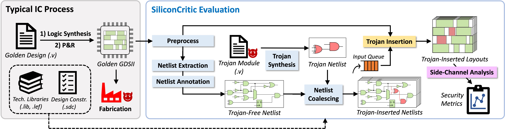

# SiliconCritic

SiliconCritic is a simulation-based, extensible framework that leverages design-time techniques to simulate the blackbox foundry-level hardware Trojan attacks and post-fabrication analysis, bridging the gap between real Trojan attacks and threat prediction. Here is an overview of SiliconCritic flow.



SiliconCritic encodes the difficulty of inserting a specific Trojan into a finalized physical layout by measuring the variation of side-channel parameters (timing, power) after the simulated Trojan insertion, where larger deviations denote better detectability and thus enhanced security.

In this repo, `GDSII-Guard` is the implementation of our previous work, an automatic framework that strengthens finalized layouts via ECO against fabrication-time Trojans while preserving design PPA.

## Publications
- Xinming Wei, Jiaxi Zhang, Guojie Luo, **"Rethinking IC Layout Vulnerability: Simulation-Based Hardware Trojan Threat Assessment with High Fidelity,"** in IEEE Symposium on Security and Privacy (SP), 2024 ([paper](https://www.computer.org/csdl/proceedings-article/sp/2024/313000a160/1Ub24jI4NB6))
- Xinming Wei, Jiaxi Zhang, Guojie Luo, **"GDSII-Guard: ECO Anti-Trojan Optimization with Exploratory Timing-Security Trade-Offs,"** in ACM/IEEE Design Automation Conference (DAC), 2023 ([paper](https://ieeexplore.ieee.org/abstract/document/10247697))

## Prerequisites
- Python (3.7 or later)
- Icarus Verilog (10.1 or later) and Pyverilog
  ```bash
  sudo apt install iverilog
  pip3 install pyverilog
  ```
- Cadence Genus (18.12) and Innovus (18.12)
  - Other versions may also work, but not tested
  - Ensure command `genus` and `innovus` can be directed invoked from shell

## How to Run
SiliconCritic provides [Nangate FreePDK45 Open Cell Library](https://eda.ncsu.edu/freepdk/freepdk45/) as the default technology library. If you need to customize your technology, specify the paths to your own `.lib` and `.lef` files. Go to the project directory and run with command line arguments for the whole-flow security assessment. Descriptions of argument options can be found by running the following,
```bash
cd <project directory>
python3 main.py --help
```
We also provide an example PIC controller design to be attacked by the keyleak Trojan. There is a variant of the original design, enhanced by GDSII-Guard. To run the example assessments,
```bash
./examples/attack_pic_16f84_core_w_keyleak.sh               # Base design
./examples/attack_pic_16f84_core_gdsiiguard_w_keyleak.sh    # GDSII-Guard-enhanced design
```
The result reports will be saved under `<work_dir>/reports_total/`. In the example attack, the design enhanced by GDSII-Guard leaves insufficient empty spaces for keyleak Trojan placement, raising errors (can be found in `<work_dir>/attacks/i/LOG/innovus.log`) at ECO stage:
```log
**WARN: (IMPSP-2020):	Cannot find a legal location for instance 'trojan/counter_reg[1]' (Cell DFF_X1).
Type 'man IMPSP-2020' for more detail.
**WARN: (IMPSP-2020):	Cannot find a legal location for instance 'trojan/counter_reg[2]' (Cell DFF_X1).
Type 'man IMPSP-2020' for more detail.
**WARN: (IMPSP-2020):	Cannot find a legal location for instance 'trojan/counter_reg[3]' (Cell DFF_X1).
Type 'man IMPSP-2020' for more detail.
**WARN: (IMPSP-2020):	Cannot find a legal location for instance 'trojan/counter_reg[4]' (Cell DFF_X1).
Type 'man IMPSP-2020' for more detail.
**WARN: (IMPSP-2020):	Cannot find a legal location for instance 'trojan/counter_reg[5]' (Cell DFF_X1).
Type 'man IMPSP-2020' for more detail.
**WARN: (IMPSP-2020):	Cannot find a legal location for instance 'trojan/counter_reg[6]' (Cell DFF_X1).
Type 'man IMPSP-2020' for more detail.
**WARN: (IMPSP-2020):	Cannot find a legal location for instance 'trojan/counter_reg[7]' (Cell DFF_X1).
Type 'man IMPSP-2020' for more detail.
**WARN: (IMPSP-2020):	Cannot find a legal location for instance 'trojan/counter_reg[8]' (Cell DFF_X1).
Type 'man IMPSP-2020' for more detail.
**WARN: (IMPSP-2020):	Cannot find a legal location for instance 'trojan/counter_reg[9]' (Cell DFF_X1).
Type 'man IMPSP-2020' for more detail.
**ERROR: (IMPSP-2021):	Could not legalize <9> instances in the design. Check warning message IMPSP-270, IMPSP-452, IMPSP-2024, IMPSP-2039, IMPSP-2040, IMPSP-2042 or IMPSP-2020 in log file for more details.
```

